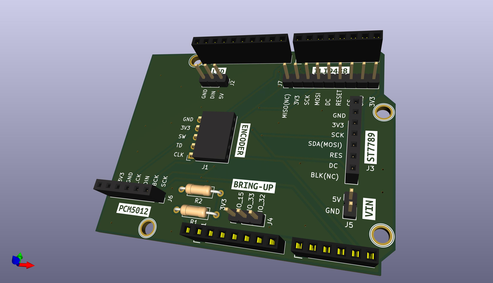

# esp32-internet-raido-v4

find kicad project files in [here](https://github.com/kawashimaken/esp32-internet-raido-v4/tree/main/hardware/kicad/esp32_internet_radio_v4)

I use KiCad 6.0.5 for this project.

* We can also use vertical pin socket for ENCODER. 

# Wemos D1 R32

This extension board is designed for this:
https://ja.aliexpress.com/item/1005001621901111.html
